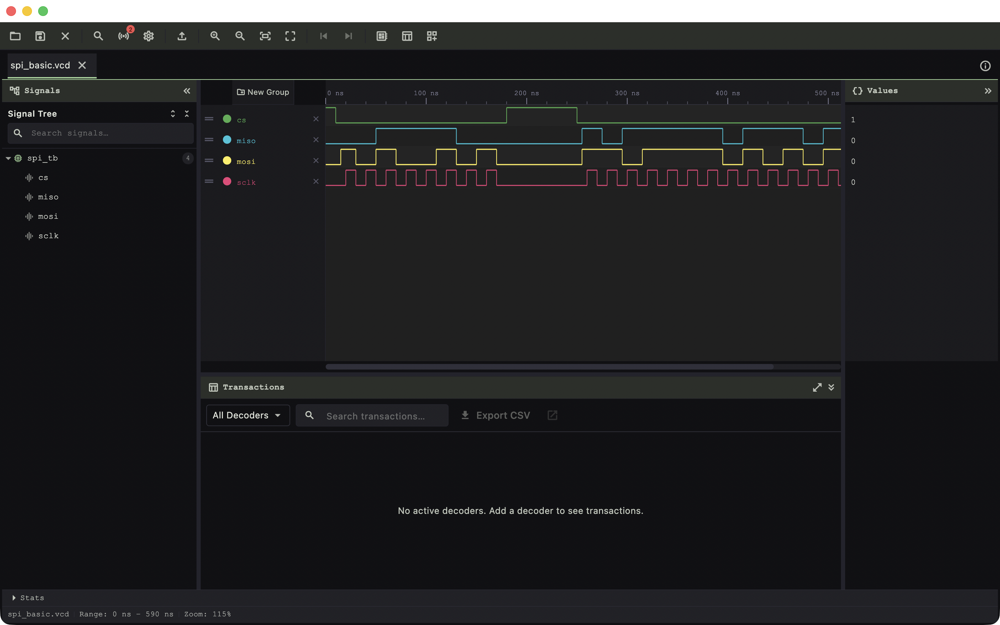

# wavecrux

[](LICENSE)

WaveCrux is a waveform viewer for silicon development: it opens the VCD, FST and
GHW dumps your simulator already produces, decodes the buses inside them into
readable transactions, and renders the result fast enough to stay usable at
multi-gigabyte scale. Open core, part of Ferrite Engineering's EDACrux suite.



<sub>WaveCrux showing a decoded SPI capture — four signals plotted from `spi_basic.vcd`.</sub>

## Status

Public beta. Implemented in this repository today:

- **Waveform engine** — VCD, FST and GHW via the [wellen](https://github.com/ekiwi/wellen)
  Rust crate through `dart:ffi` on desktop and mobile, and the same crate compiled
  to WebAssembly on the web. Lazy signal loading and LZ4-compressed storage.
- **Legacy GTKWave captures** — `.lxt` and `.lxt2` are converted to FST at open
  time by the clean-room `lxt2fst` crate (linked into the same native library as
  wellen, and compiled to WebAssembly for the web), then read like any other FST.
  Desktop and mobile cache the converted FST next to the source.
- **Protocol decoders** — SPI, I²C, UART, AXI4-Lite, APB, AHB-Lite, Wishbone
  (B3/B4) and SPI flash (stacked on SPI), plus a RISC-V instruction-trace decoder
  driven by TOML ISA tables, with a transaction table alongside the waveform.
- **Decoder plugin loader** — a documented C ABI (`include/wavecrux_decoder.h`)
  and a desktop FFI loader that registers user-contributed decoders at startup,
  with per-plugin failure isolation. Reference implementations in C and Rust live
  in [`examples/`](examples/).
- **Stage** — a panel of schematic-style tiles driven from signal values, including
  a pipeline diagram reconstructed from `valid` / `stall` / `flush` pins.
- **Workspace** — multi-tab, split-pane, saveable `.wavecrux` sessions.
- **WCP remote control** (desktop) — an external driver protocol on TCP 54321 so
  CI, an editor or a simulator can drive the viewer.
- **CXP cross-probe** — the suite's peer protocol (TCP 54322), for selection
  hand-off with NetCrux, LintCrux and SimCrux. Open core and ungated by design:
  gating it would suppress the cross-product workflows the suite exists for.
- Update checks, the in-app issue reporter, and en/zh_CN/zh/ja/ko localization.

## Pattern reference

`wavecrux` is the reference implementation of the open-core + Pro/Enterprise
overlay pattern the rest of the suite follows:

- This repository is the open-core viewer.
- A closed-source Pro overlay consumes this repo as a Git submodule, depends on
  it through a pubspec `path:` entry, and layers Pro/Enterprise features via a
  `proOverrides` list spread into the open-core `ProviderScope`. Open core never
  imports the overlay; the overlay fills seams that default to no-ops here.

A commercial Pro edition funds development — see [wavecrux.app](https://wavecrux.app).

## Platform support

| Platform | State | Notes |
|---|---|---|
| Linux | Supported | Primary target. |
| macOS | Supported | macOS 12.0 or later. |
| Windows | Supported | |
| Web | Supported | Same `wellen` engine via WebAssembly; single-threaded. |
| iOS / iPadOS | Supported | Multi-pane on iPad; full-screen canvas on iPhone. |
| Android | Supported | |

## Prerequisites

Opening a waveform needs nothing but the app. Building from source needs:

- **Flutter** — the version pinned in CI (`.github/workflows/ci.yml`).
- **Rust toolchain** — for the `wellen_ffi` native library on desktop and mobile.
  The web build uses a prebuilt WASM module.

## Build & run

```bash
git submodule update --init --recursive        # crux-shared
flutter pub get

cd native/wellen_ffi && cargo build --release   # native waveform engine
cd ../..

dart run build_runner build --delete-conflicting-outputs   # Riverpod codegen
flutter run -d macos        # or -d linux, -d windows, -d chrome
```

## Try it

[`examples/`](examples/README.md) holds ready-to-open sessions. Launch
WaveCrux, use **File → Open File** (`Cmd/Ctrl+O`) and pick the `.wavecrux` in
one of these — the picker accepts session files alongside `.vcd` / `.fst` /
`.ghw`, and opens the trace named inside:

- [`examples/five-buses/`](examples/five-buses/five-buses.wavecrux) — SPI,
  I²C, UART, AXI4-Lite and APB decoded simultaneously over one 60 µs trace,
  signals already grouped per bus and the transaction table populated on
  open. Five sibling scopes in one dump, which is what a real testbench
  produces.
- [`examples/pipeline-diagram/`](examples/pipeline-diagram/pipeline-diagram.wavecrux)
  — the **Stage** panel: a Pipeline Diagram tile reconstructing a five-stage
  in-order pipeline from `valid` / `stall` / `flush` pins, with a stall and a
  flush visible as a shape. Click a cell to move the cursor to that cycle.

**Neither needs a simulator, a toolchain, a decoder plugin or a network
connection.** Both traces are committed beside their sessions and named
relatively, so the examples open from any checkout without editing.

## Contributing

Read [`CONTRIBUTING.md`](CONTRIBUTING.md) first — contributions require a
signed Contributor License Agreement ([`CLA.md`](CLA.md)). [`docs/ARCHITECTURE.md`](docs/ARCHITECTURE.md) is the engineering reference:
tech stack, architectural rules, and the extension-point seams the Pro overlay
plugs into.

The quality gates, all of which must pass. On a fresh clone, run
`make bootstrap` once first; [`CONTRIBUTING.md`](CONTRIBUTING.md#quality-gates)
says what it builds and why.

```bash
flutter analyze --fatal-infos --fatal-warnings   # zero-warning policy
flutter test
cd native/wellen_ffi && cargo test
```

A decoder is the easiest first contribution — the plugin ABI is open-core by
design, and [`examples/decoder-plugin-demo/`](examples/decoder-plugin-demo/)
(1-Wire, in C) and its [Rust port](examples/decoder-plugin-demo-rust/) are
meant to be cloned.

## License

WaveCrux open core is licensed under the Apache License 2.0. See
[`LICENSE`](LICENSE) for the full text and [`NOTICES`](NOTICES) for
third-party attributions. Contributions require a signed
Contributor License Agreement — see
[`CONTRIBUTING.md`](CONTRIBUTING.md).

Apache-2.0 §6 grants no trademark rights, so the name and logo are
covered separately — see [`TRADEMARK.md`](TRADEMARK.md). Forks are
welcome; they just need a different name.
